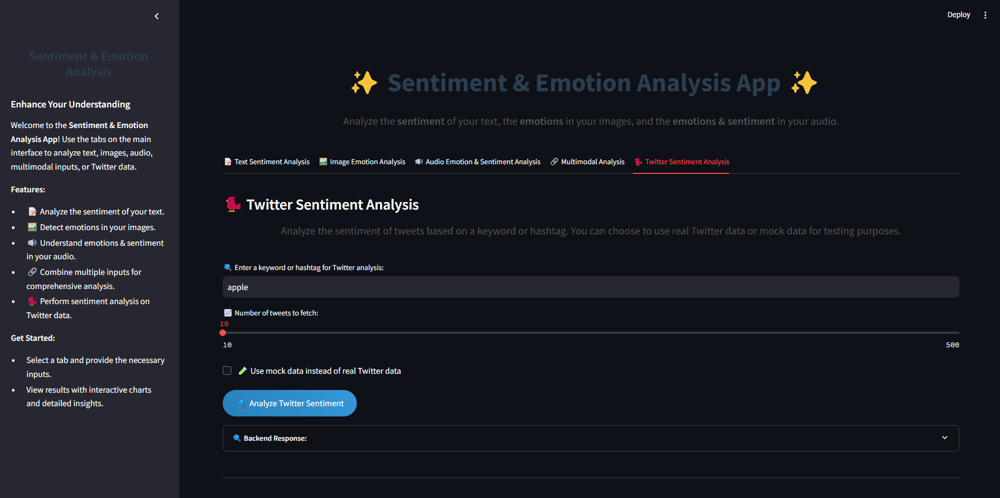
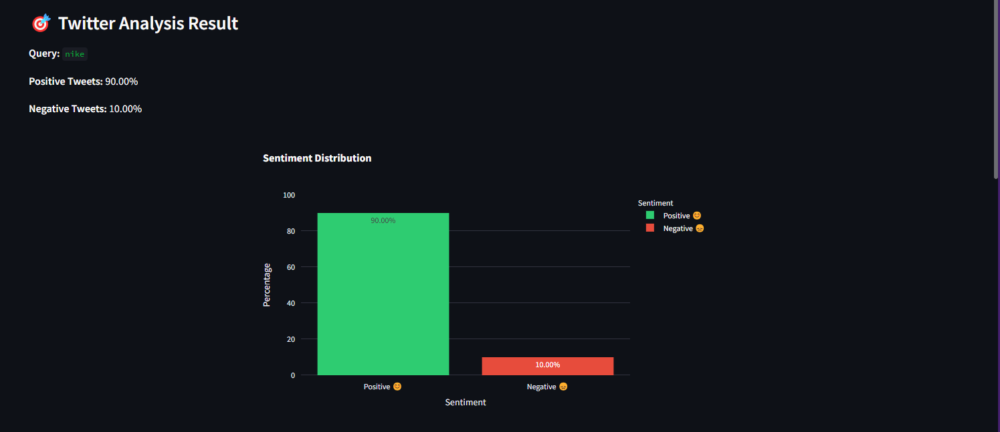
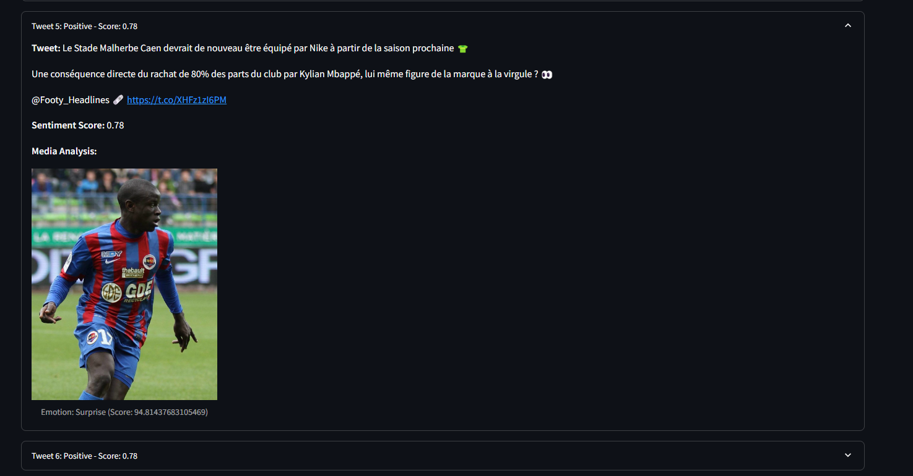

# Sentiment Analysis on X



## 🚀 Overview
**Sentiment Analysis on X** is a web application that provides real-time sentiment analysis of posts on X. It integrates **text**, **image**, and **audio** analysis for a comprehensive understanding of public sentiment. Users can fetch posts based on keywords or hashtags, analyze their sentiment, and visualize the results with interactive charts.

## 🖍️ Features
- **Real-Time Tweet Analysis**:
  - Fetch tweets based on user-defined queries.
  - Analyze sentiment across text, images, and audio.
- **Multimodal Sentiment Analysis**:
  - Text analysis using a fine-tuned **BERT** model.
  - Image emotion analysis with **DeepFace**.
  - Audio emotion detection using **Wav2Vec2**.
- **Interactive Visualizations**:
  - Sentiment distributions (positive, negative).
  - Interactive charts.
- **Flexible Input Options**:
  - Use mock data for testing.
  - Perform live analysis with the X API.

## 💡 Use Cases
- **Marketing**: Monitor brand sentiment during campaigns.
- **Politics**: Analyze public opinion on policies or events.
- **Customer Support**: Detect and address complaints.
- **Media**: Gauge audience reactions to new releases.

---

## 🛠️ Technologies Used
### Frontend:
- **[Streamlit](https://streamlit.io/)**: Interactive user interface for data visualization and analysis.

### Backend:
- **[FastAPI](https://fastapi.tiangolo.com/)**: Efficient backend framework for API handling and integration.
- **[Transformers](https://huggingface.co/transformers)**: For fine-tuned **BERT** model.
- **[DeepFace](https://github.com/serengil/deepface)**: For image emotion detection.
- **[Wav2Vec2](https://huggingface.co/models)**: For audio emotion recognition.

---

## 📂 Project Structure
```plaintext
.
├── app2/
│   ├── models/                # Pre-trained models for text, image, and audio analysis
│   ├── utils/                 # Utility functions (data preprocessing, API integration, etc.)
│   ├── routers/               # API endpoints
│   └── main.py                # Entry point for the backend application
|   └── frontend/
│       └── app_text.py            # Streamlit application code
├── mock_data/                 # Mock datasets for testing
├── requirements.txt           # Python dependencies
└── README.md                  # Project documentation
```

---

## 📊 Demo
### Example Analysis:
1. **Keyword: "Apple"** (Mock Data)
   - **Positive Sentiment**: 70%
   - **Negative Sentiment**: 30%

2. **Live Query: "Nike"**
   - **Positive Sentiment**: 65%
   - **Negative Sentiment**: 35%




---

## 📦 Installation and Usage
### Prerequisites:
- **Python 3.8+**
- **X API Key** (for live tweet fetching)

### Installation:
1. **Clone the Repository**:
   ```bash
   git clone https://github.com/your-username/sentiment-analysis-on-x.git
   cd sentiment-analysis-on-x
   ```

2. **Install Dependencies**:
   ```bash
   pip install -r requirements.txt
   ```

3. **Run the Backend (FastAPI)**:
   ```bash
   uvicorn app.main:app --reload
   ```

4. **Run the Frontend (Streamlit)**:
   ```bash
   streamlit run frontend/app_text.py
   ```

---

## 🚧 API Endpoints
### **`POST /analyze-text`**
- Input: Text
- Output: Sentiment (positive, negative) with confidence scores.

### **`POST /analyze-image`**
- Input: Image
- Output: Detected emotion (e.g., happy, sad, angry) with confidence scores.

### **`POST /analyze-audio`**
- Input: Audio
- Output: Detected emotion (e.g., happy, sad, angry) with confidence scores.

### **`GET /analyze-twitter`**
- Input: Keyword/hashtag
- Output: Sentiment distribution for tweets.

---

## 🔄 Future Enhancements
- Expand the sentiment model to support **multilingual analysis**.
- Add keyword and hashtag **trend detection**.
- Optimize real-time analysis for **large-scale datasets**.
- Enhance the user interface for better accessibility.

---

## 🙏 Acknowledgments
- **[Hugging Face](https://huggingface.co/)** for providing pre-trained models.
- **[DeepFace](https://github.com/serengil/deepface)** for image emotion analysis.
- **[Twitter API](https://developer.twitter.com/)** for real-time data fetching.

---

## 🛡️ Contact
For any inquiries, feel free to reach out:
- **Email:** nicologiuse2003@outlook.it
